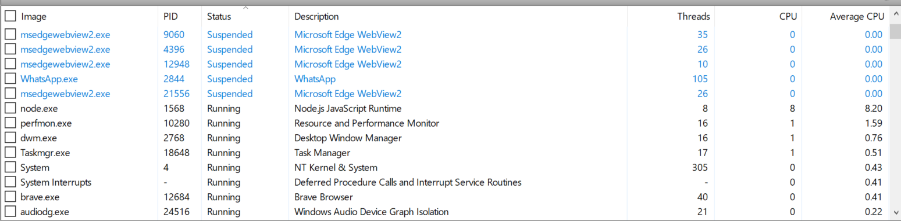
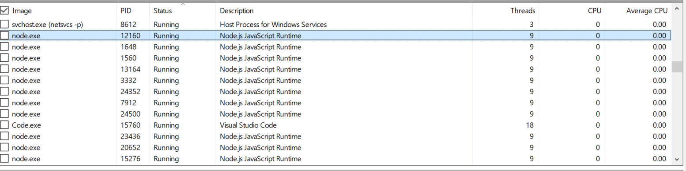

# Scaling Node.js Server

This repository demonstrates vertical scaling of a Node.js server. It highlights the performance differences between running a single Node.js server process and utilizing the `cluster` module to distribute the load across all CPU cores.

## Features

1. **Vertical Scaling Test with Single Node.js Server**
   - A simple TypeScript code running an infinite loop to simulate high CPU usage.
   - Observed that Node.js, being single-threaded, utilizes only one core of the CPU.
   - Multiple server instances were started manually in different terminals to distribute the load manually.

2. **Load Distribution Using Clustering**
   - Used Node.js `cluster` module to fork workers and distribute the load across all CPU cores.
   - Each worker serves the same server logic and independently handles incoming requests.

## Implementation Details

### Steps to Run the Code

#### 1. Single-Threaded Test

This code contains an infinite loop:
```typescript
let cnt = 0;
while (1) {
  cnt++;
}
```
Observe the CPU utilization to see that only one core is being used.

#### 2. Clustering with `cluster` Module
Use the src/index.ts code for clustered scaling.


Compile & Run the server:
```bash
tsc -b 
node dist/index.js
```

### Observations

#### Single Thread
- CPU utilization is limited to a single core regardless of the load.
- Manually starting multiple server instances in separate terminals partially distributes the load but is inefficient.

#### Clustering
- The `cluster` module spawns workers equal to the number of CPU cores, effectively distributing the load.
- Each worker independently handles requests, improving the overall CPU utilization.

### Performance Snapshots
- **Single Node.js Server:**
  - 

- **Clustered Server:**
  - 

## Why Choose Node.js?
Node.js is a popular choice for servers because it is:
- Easy for developers to learn and use.
- Supported by a large ecosystem and active community.
- Efficient for handling I/O-intensive operations.
- Easier for companies to hire skilled engineers due to its widespread adoption.

While Node.js excels in certain scenarios, multi-threaded languages like Rust, Go, and Java are better

## Conclusion
The `cluster` module is an effective way to achieve vertical scaling in Node.js by leveraging all available CPU cores. This approach enhances the performance and scalability of Node.js applications in multi-core environments.

